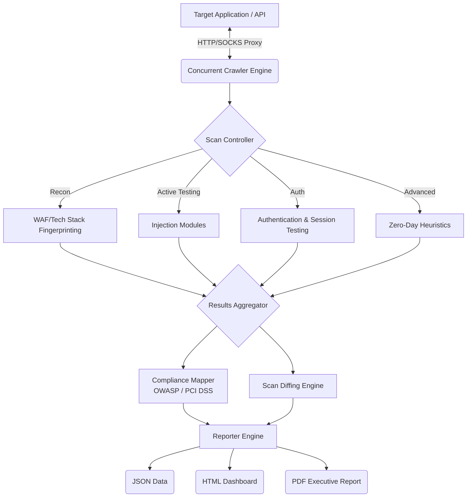

# ReconStrike-ng — Technical Project Report
## Advanced Web & Network Vulnerability Assessment Framework (Version 1.0)

---

# 1. Executive Summary

**ReconStrike-ng** is an enterprise-grade, professional vulnerability assessment framework designed for penetration testers, security auditors, and DevSecOps teams. Written entirely in Python, it provides automated, zero-false-positive discovery of vulnerabilities across both web applications and network infrastructure.

By integrating seamlessly into CI/CD pipelines and mapping findings directly to industry standards (OWASP Top 10 2021 and PCI DSS v4.0), ReconStrike-ng eliminates the gap between security testing and rapid software deployment. It replaces expensive, cumbersome legacy scanners with a lightweight, multi-threaded engine capable of executing 43 distinct vulnerability scan modules concurrently.

# 2. Primary Use Cases

1. **Automated DevSecOps Integration:** Integrated directly into CI/CD workflows via GitHub Actions or GitLab CI. The scanner runs headless on every push or pull request, failing the build (exit code 1 or 2) if Critical or High severity vulnerabilities are detected, preventing vulnerable code from reaching production.
2. **Comprehensive Penetration Testing:** Security engineers utilize ReconStrike-ng's 8 scanning profiles—ranging from passive reconnaissance to aggressive zero-day heuristic fuzzing—to systematically map attack surfaces, bypass Web Application Firewalls (WAFs), and exploit complex injection flaws (SQLi, SSTI, Command Injection).
3. **API Security Validation:** Modern architectures rely heavily on REST and GraphQL APIs. ReconStrike-ng features dedicated API scanning logic to automatically discover endpoints, handle JWT authentication, and test for Insecure Direct Object Reference (IDOR), Mass Assignment, and OAuth misconfigurations.
4. **Compliance & Audit Reporting:** External auditors and compliance teams utilize ReconStrike-ng to generate point-in-time PDF and HTML reports. Findings are automatically mapped against PCI DSS v4.0 requirements, providing immediate compliance posture verification.
5. **Continuous Attack Surface Monitoring:** Organizations run ReconStrike-ng on a schedule (e.g., weekly) utilizing the built-in "Scan Diffing" feature to compare the current vulnerability state against historical baselines, allowing teams to track remediation velocity and spot newly introduced risks.

# 3. Core Architecture

ReconStrike-ng employs a highly modular, decoupled architecture. The core logic is orchestrated by a multi-threaded concurrent crawler that feeds endpoints into single-responsibility scan modules.

## 3.1 High-Level Architecture Diagram



## 3.2 Technology Stack

| Component | Technology | Rationale |
|-----------|-----------|-----------|
| **Core Engine** | Python 3.10+ | Ensures cross-platform compatibility, vast networking libraries, and ease of extending scan modules. |
| **Concurrency** | `concurrent.futures` | Python native multi-threading allows 5-10x faster concurrent crawling without heavy dependencies. |
| **Network Layer** | `requests`, `urllib3` | Battle-tested HTTP handling with native SOCKS proxy and Tor routing support. |
| **Parsing** | `beautifulsoup4` | Resilient HTML DOM parsing for form extraction and DOM-XSS analysis. |
| **Reporting** | `fpdf2`, `json` | Capable of emitting machine-readable pipeline data and stakeholder-ready PDFs. |

# 4. Scan Modules and Coverage

ReconStrike-ng encompasses 43 specialized modules designed with a **zero false positive architecture** (utilizing baseline behavioral comparison and double-verification).

### 4.1 Injection & Server-Side
- **SQL Injection:** Blind, Error-based, and Time-based inference.
- **Cross-Site Scripting (XSS):** Reflected, Stored, and DOM-based execution.
- **Server-Side Request Forgery (SSRF):** Internal network mapping and metadata extraction.
- **XML External Entity (XXE) & Command Injection (CMDi):** OS-level execution vectors.

### 4.2 Authentication & Authorization
- **JWT Vulnerabilities:** None-algorithm attacks, weak secret brute-forcing.
- **Insecure Direct Object Reference (IDOR):** Horizontal and vertical privilege escalation.
- **OAuth Misconfigurations:** Improper state handling and open redirects.

### 4.3 Advanced Vulnerabilities
- **HTTP Request Smuggling:** CL.TE and TE.CL desync attacks.
- **Web Cache Poisoning:** Unkeyed parameter injection.
- **Race Conditions:** Multi-threaded concurrency exploitation.
- **Zero-Day Heuristics:** Fuzzing for anomalous structural server crashes.

# 5. Pipeline and CI/CD Integration

ReconStrike-ng is natively built for automation. It requires zero user interaction and outputs deterministic exit codes.

```yaml
# Example CI/CD Pipeline (GitHub Actions)
- name: Run ReconStrike-ng DAST
  run: |
    python3 reconstrike.py -t ${{ env.TARGET_URL }} \
      --profile api \
      --ci \
      --severity-threshold HIGH \
      --json-file reports/security.json
```
*If a High or Critical vulnerability is identified, ReconStrike-ng exits with code 2 or 1 respectively, immediately halting the deployment pipeline.*

# 6. Conclusion

ReconStrike-ng represents a significant leap forward in accessible, professional-grade security tooling. By combining the depth of a manual penetration testing framework with the speed and reliability required for automated DevSecOps pipelines, it provides organizations with an uncompromising, continuous defense against both known CVEs and novel architectural vulnerabilities.
